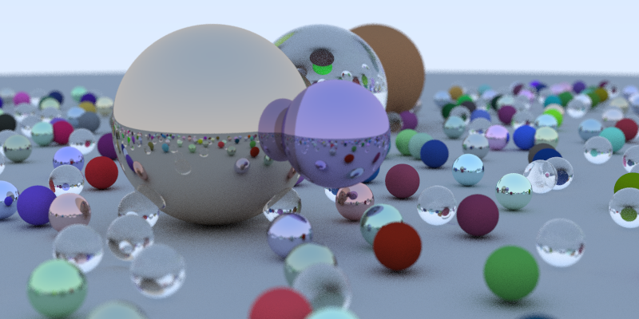
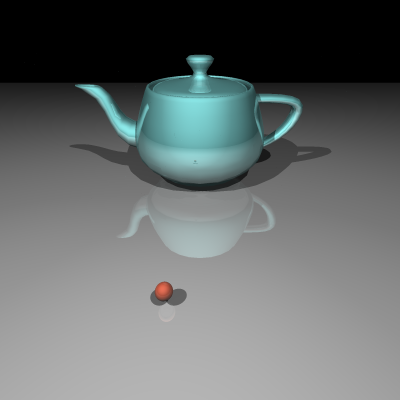

# Ray Tracing
Project for computer graphics courses

## 👍Intro:

This project is about building a basic ray tracer for simple scenes. 

Ray-tracing is a technique for computing intersections between rays and surfaces. It’s another technique for rendering images of 3D objects (different from the commonly used rasterization framework). To generate images, ray tracing loops over all the pixels in the image, generate a ray for each pixel, cast this ray into the scene and look for a possible intersection between this ray and any surface in the scene.

In this project, we have generated scenes with [random balls](https://github.com/SUcy6/ray-tracing/tree/main/ray-trace) and more complex scenes with [cool models](https://github.com/SUcy6/ray-tracing/tree/main/scene-raytrace1) (customized files). Due to time and resources limits, the results may not be of really high-quality, but they are already pretty cool.

## ⚽Random Balls:

The balls are drawed with randomly generated geometry data (center position, radius, materials type). There are 3 kinds of materials - lambertian, metal, and dielectric. Lambertian is diffuse, metal is reflected, and dielectric is transparent. A camera is included and can produce defocus blur.

### Some results:

**Three different materials** - lambertian (middle), metal (top), and dielectric (bottom). 

**Defocus Blur** - results of different camera aperture

 
[Left]: *Aperture = 1*; [Right]: *Aperture = 0.1*

**Number of samples per pixe**l - increase the number of samples per pixel can produce better results but it takes more time. On my laptop, it takes more than one hour for one image with 100 samples per pixel. 300 samples and 500 samples take even more time.

100 samples per pixel ( I wrongly set the position of the purple metal ball here. That’s why it is floating : (

300 samples per pixel 

## 🙉 Scene with more complex models

Balls are regular shapes, that means they are easy to manipulate. When it comes to real-world situations, we need to handle more complex geomtries (models with polygon faces or triangle faces). The file I/O is annoyance. In this part, we directly used some customized files (that includes model shapes, materials, and hittable information) for ray tracing. This part is derived from course materials. For more information, please go [here](https://github.com/SUcy6/ray-tracing/tree/main/scene-raytrace1).

### Results:

## Reference materials:

*[An Overview of the Ray-Tracing Rendering Technique](https://www.scratchapixel.com/lessons/3d-basic-rendering/ray-tracing-overview) and its following-up tutorials*

*[Ray Tracing in One Weekend Book Series](https://github.com/RayTracing/raytracing.github.io)*

*course materials from COMP3271-HKU*
