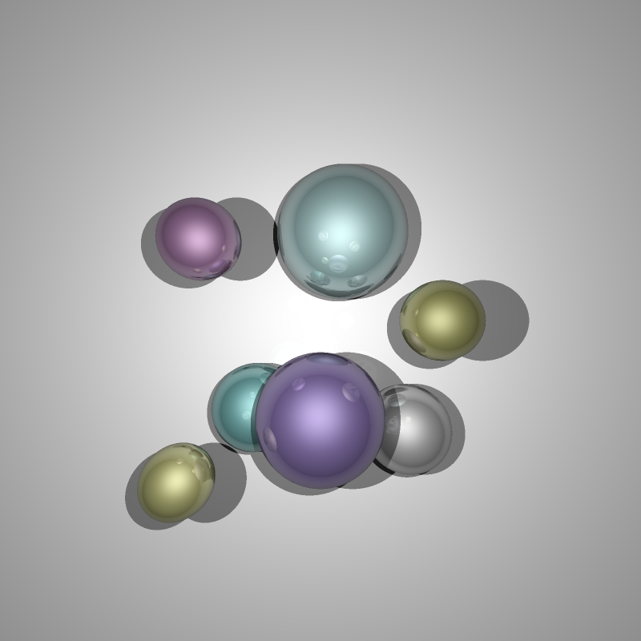
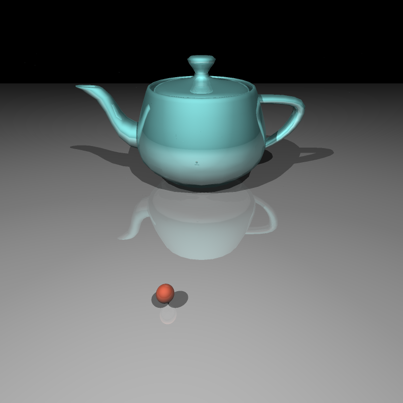

# README

## Ray-tracing Rendering

Our project is a program that renders and outputs png images with ray-tracing technique, given scene files with models in .ply format.

## Youtube video: https://youtu.be/zG0XBcqhRsE

## Screenshots

- Name and partners name(At most teams of 2 folks total)
    - Team member 1: *Changyue Su*
    - Team member 2: *Wenran Zhao*
- How many hours did it take you to complete this final project? ~45 hrs
- Did you use any external resources?
    - *[An Overview of the Ray-Tracing Rendering Technique](https://www.scratchapixel.com/lessons/3d-basic-rendering/ray-tracing-overview) and its following-up tutorials*
    - *[Ray Tracing in One Weekend Book Series](https://github.com/RayTracing/raytracing.github.io)*
    - course materials from COMP3271-HKU
